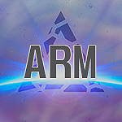

# ARMansion
    

> ⚠️ **NOT CROSS-PLATFORM** ⚠️  
> The application is currently exclusive to smartphones with Android.

ARMansion represents the culmination of a high school final project, employing Unity, C#, and Vuforia technologies. This game seamlessly integrates digital components into the real world, providing players with an immersive and engaging experience. Through its innovative design and implementation, this project underscores the potential of augmented reality technology in modern gaming.

    

## 🛠️ Build With 
- [Unity](https://docs.unity.com/) - Game graphics engine.
- [C#](https://learn.microsoft.com/en-us/dotnet/csharp/) - Unity programming language.
- [Vuforia](https://developer.vuforia.com/library/) - Augmented Reality library.

## 📄 License 
This project is licensed under the [Apache License 2.0](./LICENSE)
